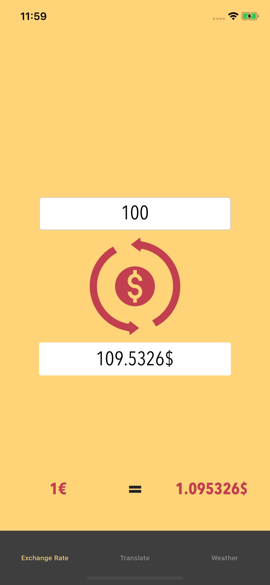
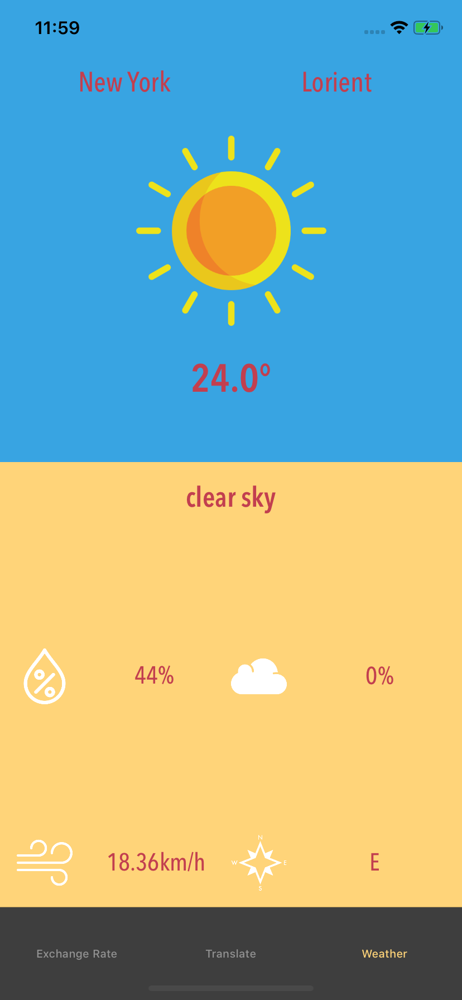
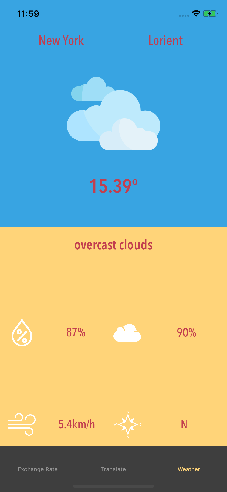

# AnAmericanDream

### Contexte

Application réalisé dans le cadre de mon parcours développeur d'application iOS avec Openclassrooms (2018-2020).
Application pour iPhone développé en langage Swift.
Projet 9/12.

### Le projet

Création de l'application AnAmericanDream pour iPhone(design responsive).
Application comprenant 3 onglets :
  - obtenir le taux de change
  - obtenir la traduction en anglais
  - comparer la météo locale avec un autre lieu 
  

### Compétences techniques

- Intégration des API Fixer / GoogleTranslate / OpenWeatherMap
- URLSession / URLSessionDataTask
- Gestion de la navigation et des formulaires
- TabBarController
- Tests Unitaires

### Screenshots

   

